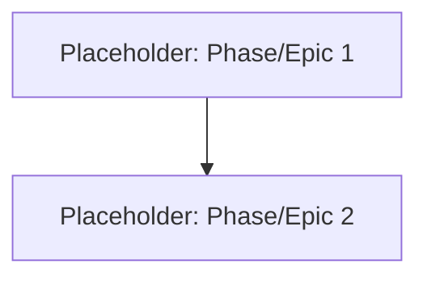

# Project Roadmap: [Project Name - To be filled by LLM from system_manifest.md if possible, or placeholder]

**Last Updated**: [YYYY-MM-DD] <!-- To be updated each time the roadmap is modified -->

## 1. Overall Project Vision & Goals
<!-- Briefly derived from system_manifest.md - high-level purpose. To be populated during initial creation if roadmap is new. -->
*   {Placeholder: Project Goal 1}
*   {Placeholder: Project Goal 2}

## 2. Major Project Phases / Epics
<!-- 
This section should outline the main phases or large-scale epics of the project. 
For each phase/epic, provide a brief description, its current status, and links to more detailed planning documents if they exist.
Initially populated based on system_manifest.md and dependency analysis if roadmap is new.
The Dispatcher will update this section based on completed strategy cycles.
-->

### Phase/Epic Example: [Name of Phase/Epic]
*   **Description**: {Brief description}
*   **Status**: {Not Started | Initial Planning (Cycle ID) | In Progress (Cycle ID) | Partially Completed (Cycle ID) | Completed (Cycle ID)}
*   **Key Objectives**:
    *   {Objective 1}
    *   {Objective 2}
*   **Primary HDTA Links**: 
    *   (Link to relevant `_module.md` or high-level `implementation_plan_*.md` if applicable)
*   **Notes/Key Deliverables for this Phase/Epic**:
    *   ...

---
*   *(Add more Phases/Epics as defined by the overall project scope)*
---

## 3. High-Level Inter-Phase/Epic Dependencies
<!-- Optional: Use Mermaid or a list to show major dependencies between the phases/epics if helpful. Can be populated from initial dependency visualization. -->

## 4. Key Project-Wide Milestones
<!-- List major, overarching project milestones. Initially populated if evident from high-level docs/dependencies. Include target/actual completion. -->
*   **Milestone Example**: {Description} - Status: {Planned / In Progress / Achieved [Date/Cycle ID]}

## 5. Overall Project Notes / Strategic Considerations
<!-- High-level notes relevant to the entire project's execution or long-term strategy. -->
*   {Placeholder: Note 1}

<!-- 
Instructions for Strategy Phase (Dispatcher Step 8 - Updating this Roadmap):
- When a strategy cycle completes planning for specific areas:
  1. Identify which Phase/Epic(s) in this roadmap the cycle's work contributes to.
  2. Update the 'Status' of the relevant Phase/Epic(s) (e.g., "In Progress (Cycle [CycleID])", "Partially Completed (Cycle [CycleID])").
  3. Add/update 'Key Objectives' or 'Notes/Key Deliverables' within the Phase/Epic section to summarize the cycle's planned contribution.
  4. Add links under 'Primary HDTA Links' to the newly created/updated Implementation Plans from that cycle.
  5. If the cycle planned out a new major Phase/Epic not yet listed, add it to section 2.
  6. Update 'Key Project-Wide Milestones' if the cycle's work impacts them.
  7. Update the 'Last Updated' date at the top of this document.
-->
